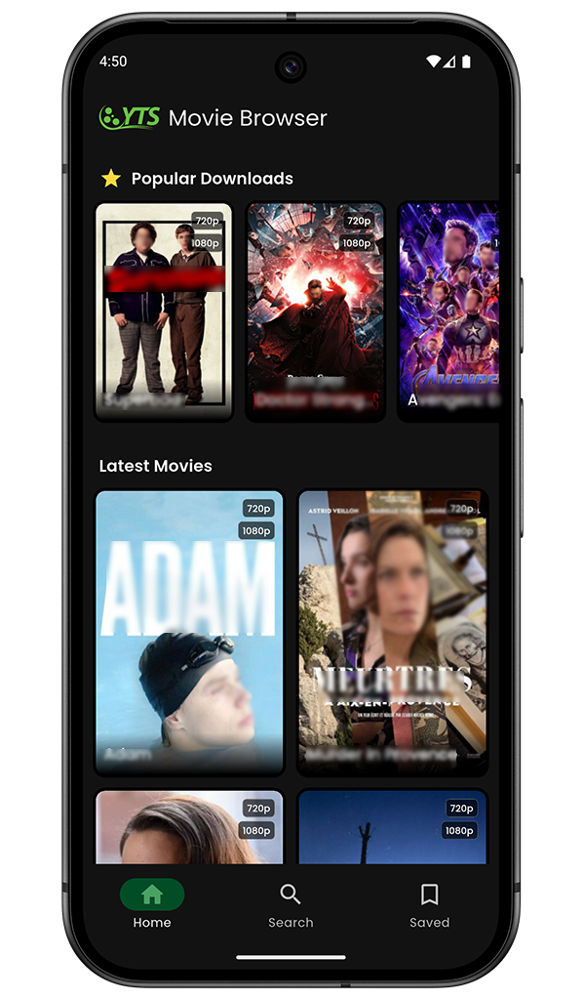
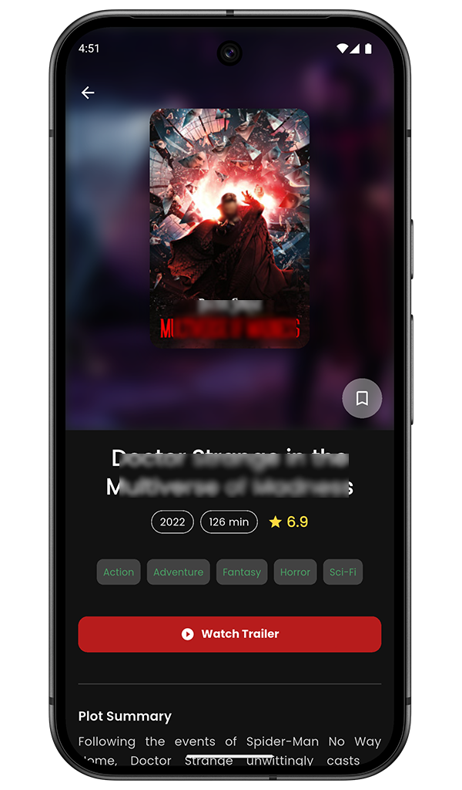
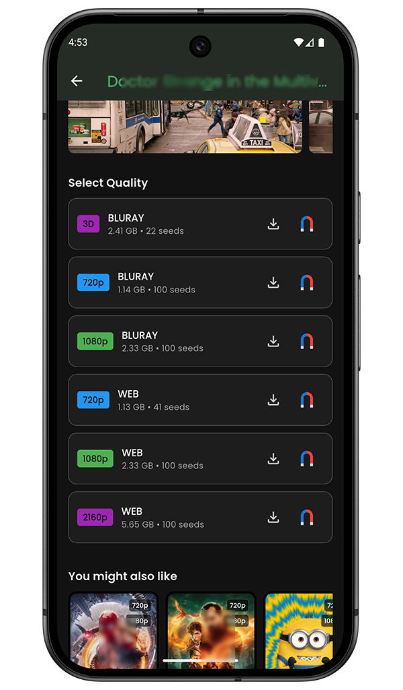

# YTS Movie Browser - Native Flutter App

> **A fast, clean and native Android browser for the YTS movie network.**
> *Built with Flutter & Dart by **dushaDev**.*

[](https://flutter.dev)
[](https://dart.dev)
[]()
[](LICENSE)

---

## About The App

**YTS Browser** is a lightweight mobile application designed to provide a seamless interface for browsing the YTS public API. It solves the frustration of slow websites and pop-up ads by offering a native, 60fps experience with direct access to magnet links and torrent files.

### Key Features

* **High Performance:** Smooth infinite scrolling and optimized image caching.
* **Advanced Search:** Filter movies by **Quality** (720p/1080p/3D), **Genre**, and **Rating**.
* **Offline Favorites:** Save movies to your local list (SQL) to view later without internet.
* **Immersive Details:**
    * High-res posters & backdrops.
    * Cast lists & Director info.
    * Screenshots gallery.
    * YouTube Trailers integration.
* **Download Ready:** One-tap **Magnet Links** or **.torrent file** downloads.
* **Smart Connectivity:** Auto-detects network loss and manages retries gracefully.
* **UI/UX:**
    * Modern Dark Mode (OLED friendly).
    * Shimmer loading effects.
    * Parallax headers.

---

## Screenshots

|                 Home Feed                 |               Movie Details               |             Search & Filters              |
|:-----------------------------------------:|:-----------------------------------------:|:-----------------------------------------:|
|  |  |  |

> *Note: Add your actual screenshots to a `docs/screenshots` folder in your repo.*

---

## Tech Stack & Architecture

This project follows a clean **MVVM (Model-View-ViewModel)** architecture using **Provider** for state management.

* **Framework:** [Flutter](https://flutter.dev/)
* **Language:** [Dart](https://dart.dev/)
* **State Management:** [Provider](https://pub.dev/packages/provider)
* **Networking:** [Dio](https://pub.dev/packages/dio) (with Interceptors for error handling)
* **Local Database:** [Sqflite](https://pub.dev/packages/sqflite) (Persisting favorites)
* **Image Caching:** [CachedNetworkImage](https://pub.dev/packages/cached_network_image)
* **Connectivity:** [Connectivity Plus](https://pub.dev/packages/connectivity_plus)
* **UI Effects:** [Shimmer](https://pub.dev/packages/shimmer), [Google Fonts](https://pub.dev/packages/google_fonts)

---

## Installation

1.  **Clone the repo:**
    ```bash
    git clone [https://github.com/dushaDev/yts_movie_browser.git](https://github.com/dushaDev/yts_movie_browser.git)
    cd yts_movie_browser
    ```

2.  **Install dependencies:**
    ```bash
    flutter pub get
    ```

3.  **Run the app:**
    ```bash
    flutter run
    ```

4.  **Build Release APK:**
    ```bash
    flutter build apk --release
    ```

---

## Disclaimer

**Please Read Carefully:**

1.  **Content:** This application acts solely as a search engine and browser for the public API provided by `yts.ag`.
2.  **Hosting:** We **do not** host, upload, or manage any video files or media content on our servers.
3.  **Copyright:** The developer (**dushaDev**) assumes no liability for how this application is used. Users are responsible for ensuring their downloads comply with their local copyright laws.

---

## Contributing

Contributions are welcome! Please feel free to submit a Pull Request.

1.  Fork the Project
2.  Create your Feature Branch (`git checkout -b feature/AmazingFeature`)
3.  Commit your Changes (`git commit -m 'Add some AmazingFeature'`)
4.  Push to the Branch (`git push origin feature/AmazingFeature`)
5.  Open a Pull Request

---

## Author

**dushaDev**

* **GitHub:** [github.com/dushaDev](https://github.com)
* **Email:** dushadevhere@gmail.com

